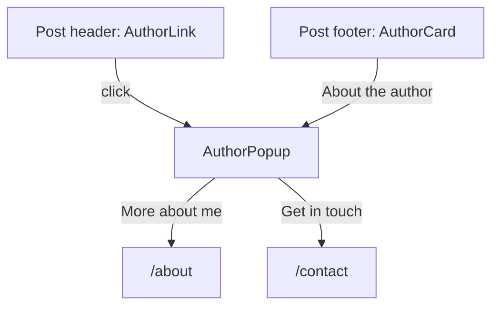

# Author Profiles: Design & Data Spec

**Status:** Approved — v1 implemented  
**Last updated:** 2026-07-01

Single source of truth for the blog author popup and post-footer card. This feature adds lightweight author context on blog posts — **not** a dedicated author page, **not** a quotes/legal/404-style experience.

---

## 1. Goals & non-goals

### Goals (v1)

- Show who wrote a post without leaving the article.
- Keep visual language aligned with portfolio pages (blog, about, vitae).
- Support a **minimal** author model suitable for rare guest authors (e.g. Gemini) with little metadata.
- Use **emoji** as the author identity marker in v1.
- Apply a **theme accent** per author for links, borders, and hover states.
- Reuse the **author card** pattern at the bottom of posts.

### Non-goals

| Item                                             | Rationale                                                                                           |
| ------------------------------------------------ | --------------------------------------------------------------------------------------------------- |
| Dedicated `/authors/[slug]` page                 | Low value unless content is compelling; defer indefinitely. Link to `/about` or `/contact` instead. |
| Avatar images                                    | v2+; emoji covers identity in v1.                                                                   |
| Long-form author bios                            | Most authors won't have enough content; keep `bio_short` only in v1.                                |
| Full social link rows                            | v2+; optional single link in v1 if needed.                                                          |
| Multi-author blog UX (filters, bylines on cards) | v2+ when guest posts are common.                                                                    |

---

## 2. UX surfaces

Only two surfaces in v1. Both share the same `AuthorProfile` data and accent styling.



### 2.1 Author link (post header)

Replace plain "By Ryan Flynn" text with a subtle trigger:

- Looks like inline metadata (`text-slate-400`), not a primary button.
- Accent color on hover (author's assigned accent).
- Optional leading emoji: `✨ Ryan Flynn`
- `aria-haspopup="dialog"`; opens popup.

### 2.2 Author popup (primary)

Compact Radix `Dialog` — same interaction family as blog search (`BlogPageClient`), **not** the heavy `ProjectModal` accent treatment.

**Content stack (top → bottom):**

1. **Identity row** — emoji (large), display name, optional role subtitle
2. **Gradient divider** — `via-slate-700` (portfolio standard)
3. **Bio** — `bio_short` only; 1–3 lines, `text-slate-300`
4. **Stats** (when computable) — e.g. `3 posts · 2 topics` with emoji prefixes
5. **Recent writing** — up to 3 post links (title + date); mini card rows
6. **Actions** — text links styled with author accent: "More about me →" (`/about`), optional "Get in touch →" (`/contact`)
7. **Close** — outline `Button` or Esc / backdrop

**Panel styling:**

```
rounded-lg border bg-slate-900/95 backdrop-blur-sm shadow-xl
max-w-md (desktop), max-w-[calc(100vw-2rem)] (mobile)
```

Accent applies to: name hover, divider center stop, recent-post hover border, action links, emoji ring (subtle). **Do not** use per-modal gradient borders or glow rings like `ProjectModal`.

### 2.3 Author card (post footer)

Placed **after** article content, **before** `BlogPostNavigation`.

```
┌────────────────────────────────────────────────────────┐
│  ✨   Written by Ryan Flynn                            │
│       Software engineer. Short bio excerpt…            │
│                              [ About the author ]      │
└────────────────────────────────────────────────────────┘
```

- Container: `rounded-lg border border-slate-700 bg-slate-800/50 p-6`
- Left: emoji in accent-tinted circle (`border` + `bg-{accent}/10`)
- Right: CTA opens the same popup as the header link
- No avatar in v1

---

## 3. Visual design

### 3.1 Design lineage

| Match                                     | Avoid                                  |
| ----------------------------------------- | -------------------------------------- |
| `PostCard`, blog header, `AboutCTA` cards | Policy tab themes                      |
| Slate base + single accent per author     | Quotes constellation / mission control |
| Radix Dialog + light motion               | 404 illustration page                  |
| `font-heading` for names                  | `ProjectModal` rainbow accent rings    |

### 3.2 Emoji (v1 identity)

- **Field:** `emoji` (single grapheme cluster, e.g. `✨`, `🤖`, `🪐`)
- Displayed at ~2rem in popup, ~1.5rem in footer card.
- Fallback: `✍️` when missing.
- Operator picks their own; guest authors can use a thematic emoji (e.g. `🤖` for Gemini).

### 3.3 Accent colors

Accents come from the **expanded site palette** in `constants/theme.ts` — not hardcoded one-offs.

**Proposed `authorAccents` registry** (to add to `constants/theme.ts` during implementation):

| Key       | Hex source             | Operator label |
| --------- | ---------------------- | -------------- |
| `sky`     | `accents.primary`      | Sky            |
| `emerald` | `accents.emerald`      | Emerald        |
| `gold`    | `accents.amber`        | Gold           |
| `ruby`    | `rose-500` (`#f43f5e`) | Ruby           |
| `violet`  | `accents.violet`       | Violet         |
| `cyan`    | `accents.cyan`         | Cyan           |
| `fuchsia` | `accents.fuchsia`      | Fuchsia        |
| `indigo`  | `accents.indigo`       | Indigo         |
| `teal`    | `accents.teal`         | Teal           |
| `orange`  | `accents.orange`       | Orange         |

Add `ruby` to `accents` in `constants/theme.ts` when implementing (alias for rose-500).

### 3.4 Accent assignment rules

1. **Operator override:** If `author.accent` is set in CMS/static data, use that key.
2. **Auto-assign:** Otherwise derive deterministically from `slug` (stable hash into `authorAccents` keys). Same author always gets the same accent; not random per page load.
3. **Collision:** Acceptable — with few authors, duplicates are fine. No uniqueness constraint.

**Operator action:** Set `accent: "emerald"` (or preferred key) on your own author record. Guest authors get auto-assigned accents unless you override.

### 3.5 Emoji in UI copy (v1)

Light emoji use in labels — portfolio tone, not admin dashboard:

| Location               | Example                                               |
| ---------------------- | ----------------------------------------------------- |
| Stats row              | `📝 12 posts · 🏷️ 8 topics`                           |
| Recent section heading | `📚 Recent writing`                                   |
| Footer card            | emoji in identity circle only (no emoji spam in body) |

Avoid emoji in buttons that already have clear text labels.

---

## 4. Data model

### 4.1 Philosophy

Minimal fields. Most authors will only ever have a name, emoji, and one sentence. Design for Gemini-scale guests, not LinkedIn-scale profiles.

### 4.2 Frontend type (`types/index.ts`)

```typescript
/** Keys into constants/theme.ts → authorAccents */
export type AuthorAccentKey =
  | "sky"
  | "emerald"
  | "gold"
  | "ruby"
  | "violet"
  | "cyan"
  | "fuchsia"
  | "indigo"
  | "teal"
  | "orange";

export interface AuthorProfile {
  id: string;
  slug: string;
  first_name: string;
  last_name: string;
  /** v1 identity marker */
  emoji: string;
  /** Operator override; auto-assigned from slug when omitted */
  accent?: AuthorAccentKey;
  /** Optional one-liner under the name */
  role?: string;
  /** Popup + footer card only — keep under ~280 chars */
  bio_short?: string;
}

/** Resolved author passed to UI — accent is always set */
export interface ResolvedAuthorProfile extends AuthorProfile {
  display_name: string;
  accent: AuthorAccentKey;
  accent_hex: string;
}
```

**Computed at read time (not stored):**

- `display_name` — `` `${first_name} ${last_name}`.trim() ``
- `post_count`, `top_tags`, `recent_posts` — from published blogs filtered by author

### 4.3 Directus `authors` collection (target schema)

New collection; `blogs.author` becomes M2O → `authors`.

| Field        | Type   | Required | v1  | Notes                                       |
| ------------ | ------ | -------- | --- | ------------------------------------------- |
| `id`         | uuid   | yes      | yes |                                             |
| `slug`       | string | yes      | yes | URL-safe key, unique                        |
| `first_name` | string | yes      | yes |                                             |
| `last_name`  | string | yes      | yes |                                             |
| `emoji`      | string | yes      | yes | Single emoji                                |
| `accent`     | string | no       | yes | One of `AuthorAccentKey`; operator sets own |
| `role`       | string | no       | yes | e.g. "Software Engineer"                    |
| `bio_short`  | text   | no       | yes |                                             |
| `status`     | enum   | yes      | yes | `published` / `draft`                       |

**Deferred (v2+):**

| Field                           | Notes                                            |
| ------------------------------- | ------------------------------------------------ |
| `avatar`                        | file (image)                                     |
| `bio_long`                      | markdown — only if author page ever ships        |
| `github`, `linkedin`, `twitter` | social URLs                                      |
| `email`                         | prefer mailto via site contact, not raw exposure |

### 4.4 Current API (today)

`blogs.author` exposes only:

```typescript
author: {
  first_name: string;
  last_name: string;
}
```

Phase 0 merges this with static fallback data until the `authors` collection exists.

### 4.5 Phase 0 fallback (`data/authors.ts`)

Static registry keyed by slug. Slug resolved from author name (normalize → `ryan-flynn`) or explicit M2O later.

```typescript
export const authorProfiles: Record<string, AuthorProfile> = {
  "ryan-flynn": {
    id: "ryan-flynn",
    slug: "ryan-flynn",
    first_name: "Ryan",
    last_name: "Flynn",
    emoji: "✨", // operator picks
    accent: "emerald", // operator picks
    role: "Software Engineer",
    bio_short: "…",
  },
  gemini: {
    id: "gemini",
    slug: "gemini",
    first_name: "Gemini",
    last_name: "",
    emoji: "🤖",
    // accent omitted → auto-assigned from slug
    bio_short: "AI writing assistant.",
  },
};
```

`resolveAuthor(partial, slug?)` in `lib/services/directus/authors.ts` (or `lib/site/authors.ts`):

1. Look up static profile by slug.
2. Merge CMS `first_name` / `last_name` over static defaults.
3. Resolve accent (override → hash).
4. Return `ResolvedAuthorProfile`.

Unknown authors: name + auto accent + `✍️` emoji; omit bio and recent posts if none.

---

## 5. Implementation map

### 5.1 New files

| Path                                     | Purpose                                                 |
| ---------------------------------------- | ------------------------------------------------------- |
| `constants/theme.ts`                     | Add `authorAccents`, `ruby`, `getAuthorAccent()` helper |
| `data/authors.ts`                        | Phase 0 static profiles                                 |
| `lib/site/authors.ts`                    | `resolveAuthor`, `getAuthorAccentHex`, slug helpers     |
| `lib/services/directus/authors.ts`       | `getAuthorBySlug`, `getRecentPostsByAuthor` (v1.1)      |
| `components/author/AuthorLink.tsx`       | Header trigger                                          |
| `components/author/AuthorPopup.tsx`      | Dialog shell (client)                                   |
| `components/author/AuthorCard.tsx`       | Shared identity block                                   |
| `components/author/AuthorPostFooter.tsx` | Footer card + popup wiring                              |
| `types/index.ts`                         | `AuthorProfile`, `AuthorAccentKey`                      |

### 5.2 Modified files

| Path                                   | Change                                                |
| -------------------------------------- | ----------------------------------------------------- |
| `app/(portfolio)/blog/[slug]/page.tsx` | `AuthorLink` in header; `AuthorPostFooter` before nav |
| `lib/services/directus/transforms.ts`  | Extend `BLOG_FIELDS` when M2O lands                   |
| `types/directus.ts`                    | `DirectusAuthor`, update `DirectusBlogPost`           |

### 5.3 Out of scope (v1)

- `app/(portfolio)/authors/[slug]/` route
- `PostCard` author byline
- Avatar upload / display
- Directus schema migration (can follow static-only v1)

---

## 6. Accessibility & UX

| Requirement         | Approach                                              |
| ------------------- | ----------------------------------------------------- |
| Keyboard            | Esc closes dialog; focus trap via Radix               |
| Focus return        | Focus restored to trigger on close                    |
| Motion              | Light fade/scale; `prefers-reduced-motion` → no scale |
| Screen readers      | Dialog labelled by author `display_name`              |
| Honest empty states | Omit sections when data missing; no fake bios         |
| Touch targets       | Footer CTA and header link ≥ 44px effective area      |

---

## 7. Testing (happy path)

| Test               | Assert                                |
| ------------------ | ------------------------------------- |
| `resolveAuthor`    | Operator accent override respected    |
| `resolveAuthor`    | Auto accent stable for same slug      |
| `AuthorPostFooter` | Renders emoji, name, opens popup      |
| `AuthorPopup`      | Shows bio, recent posts when provided |
| Unknown author     | Name + fallback emoji only            |

---

## 8. Operator decisions

| #   | Question           | Decision                         |
| --- | ------------------ | -------------------------------- |
| 1   | Your emoji         | `🪐`                             |
| 2   | Your accent        | `violet`                         |
| 3   | `bio_short` copy   | Hero section copy from home page |
| 4   | Footer CTA label   | "About the author"               |
| 5   | Popup deep link    | `/about` (no author page)        |
| 6   | Recent posts count | 3                                |

---

## 9. Related docs & files

| Topic                 | Location                               |
| --------------------- | -------------------------------------- |
| Theme accents         | `constants/theme.ts`                   |
| Blog post page        | `app/(portfolio)/blog/[slug]/page.tsx` |
| Directus collections  | `.docs/DIRECTUS.md`                    |
| Service layer pattern | `.docs/DIRECTUS.md`                    |
| TODO tracking         | `.docs/dev/TODO.md`                    |

---

## 10. Revision history

| Date       | Change                                                                        |
| ---------- | ----------------------------------------------------------------------------- |
| 2026-07-01 | v1 implemented — popup, footer card, emoji, theme accents, edge-case handling |
