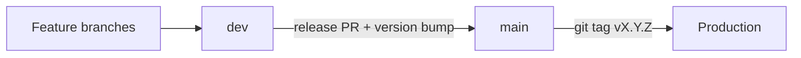

# Versioning Policy

**Status:** Active  
**Last updated:** 2026-07-01

Single source of truth for how this project versions releases while **pre-1.0**, at **1.0.0 launch**, and after.

---

## 1. Principles

| Principle                    | Rule                                                                    |
| ---------------------------- | ----------------------------------------------------------------------- |
| **One canonical number**     | `package.json` → `version` field only                                   |
| **UI reads, never writes**   | `lib/site/version.ts` exports `SITE_VERSION` from `package.json`        |
| **Version bumps on release** | Bump when promoting `dev` → `main`, not on every feature merge to `dev` |
| **Document every release**   | `CHANGELOG.md` must have a `## [x.y.z]` section matching `package.json` |
| **Tag production**           | Git tag `vX.Y.Z` on `main` after each production release                |

**Security:** Public APIs (e.g. `/api/health`) do not expose version numbers. The footer `vX.Y.Z` is intentional, low-sensitivity UI.

---

## 2. Scheme: SemVer 2.0.0 (pre-1.0 rules)

Format: `MAJOR.MINOR.PATCH` (optional `-prerelease` later if needed).

While **`MAJOR === 0`** (pre-1.0):

| Segment   | Meaning                                                                                | Examples                                               |
| --------- | -------------------------------------------------------------------------------------- | ------------------------------------------------------ |
| **PATCH** | Bug fixes, copy tweaks, dependency-only updates, refactors with no user-visible change | Fix contact validation, typo on About page             |
| **MINOR** | New features, UX improvements, CMS/schema changes, breaking changes acceptable         | Author popup, blog pagination, Directus collection add |
| **MAJOR** | Reserved for **`1.0.0`** first production launch                                       | Not used for `0.x` → `0.y` bumps                       |

After **`1.0.0`** (stable):

| Segment   | Meaning                                                     |
| --------- | ----------------------------------------------------------- |
| **PATCH** | Backward-compatible bug fixes                               |
| **MINOR** | Backward-compatible features                                |
| **MAJOR** | Breaking changes to public behavior, URLs, or CMS contracts |

---

## 3. What counts as a release

A **release** is a merge of `dev` into `main` that deploys to production (see [RELEASE_READINESS.md](./RELEASE_READINESS.md)).



| Activity                              | Version bump?                            |
| ------------------------------------- | ---------------------------------------- |
| Merge `cursor/*` → `dev`              | No                                       |
| Fix on `dev` waiting for next release | No (batch in next release)               |
| Release PR `dev` → `main`             | **Yes** — PATCH or MINOR                 |
| Hotfix directly to `main`             | **Yes** — PATCH (then backport to `dev`) |
| First production launch               | **Yes** — set **`1.0.0`**                |

---

## 4. Choosing PATCH vs MINOR (pre-1.0)

Ask: _Would a visitor notice, or would an operator change deploy/migrate steps?_

| Bump      | When                                                                                                                       |
| --------- | -------------------------------------------------------------------------------------------------------------------------- |
| **PATCH** | Fixes only; same pages and flows                                                                                           |
| **MINOR** | New page, component, or feature; notable UX; new env var; Directus schema change; dependency upgrade that changes behavior |

When unsure pre-1.0, prefer **MINOR** — frequent `0.x` minors are expected.

---

## 5. The path to 1.0.0

**`1.0.0`** is the first **production launch**, not “feature complete.”

### Launch criteria (all required)

- [ ] Operator checklist in [RELEASE_READINESS.md](./RELEASE_READINESS.md) complete
- [ ] Smoke test passed on production-like `.env`
- [ ] Mobile responsive sign-off
- [ ] `dev` → `main` release PR merged with full CI green

### How to ship 1.0.0

1. Complete launch checklist.
2. Set `package.json` version to `1.0.0` (or `pnpm run version:major` from `0.x` after reading the script warning).
3. Add `## [1.0.0] - YYYY-MM-DD` to `CHANGELOG.md`.
4. Merge to `main`, tag `v1.0.0`, deploy.

Post-1.0, follow strict SemVer for MAJOR breaking changes.

---

## 6. Current version line

| Version               | Meaning                                                                                     |
| --------------------- | ------------------------------------------------------------------------------------------- |
| **`0.2.0`** (current) | Mature pre-launch staging: core features, author profiles, infra ready; not yet live at 1.0 |
| **`0.1.0`**           | Initial site scaffold (reconstructed in CHANGELOG)                                          |
| ~~`1.1.0`~~           | Informal pre-policy number — **superseded**, do not use                                     |

---

## 7. Files and commands

| Artifact                       | Role                                                                           |
| ------------------------------ | ------------------------------------------------------------------------------ |
| `package.json`                 | **Canonical** version string                                                   |
| `lib/site/version.ts`          | `SITE_VERSION`, `parseVersion`, `isPreRelease`                                 |
| `lib/site/seo.ts`              | Re-exports `SITE_VERSION` for metadata/footer                                  |
| `CHANGELOG.md`                 | Human-readable release notes ([Keep a Changelog](https://keepachangelog.com/)) |
| `components/common/Footer.tsx` | Displays `v{SITE_VERSION}`                                                     |

### Commands

```bash
# Verify CHANGELOG documents the current package.json version
pnpm run version:check

# Bump (updates package.json only — you still edit CHANGELOG)
pnpm run version:patch   # 0.2.0 → 0.2.1
pnpm run version:minor   # 0.2.0 → 0.3.0
pnpm run version:major   # 0.2.0 → 1.0.0 (launch only pre-1.0)

# Included in full validate gate
pnpm run validate
```

### Release checklist (operator)

1. Decide PATCH vs MINOR (or 1.0.0 for launch).
2. Run the appropriate `pnpm run version:*` command.
3. Move `[Unreleased]` entries in `CHANGELOG.md` to `## [X.Y.Z] - date`.
4. `pnpm run validate` (includes `version:check`).
5. Open release PR `dev` → `main` with title `release: vX.Y.Z`.
6. After merge: `git tag vX.Y.Z && git push origin vX.Y.Z`.
7. Deploy / Docker rebuild per [RELEASE_READINESS.md](./RELEASE_READINESS.md).

---

## 8. Changelog conventions

Sections (use what applies):

- **Added** — new features
- **Changed** — behavior changes
- **Fixed** — bug fixes
- **Removed** — deleted features
- **Security** — vulnerabilities

Keep `[Unreleased]` at the top during development on `dev`. Only move items to a versioned heading when bumping for a release.

---

## 9. Out of scope (for now)

- Automated semantic-release / conventional-commit bots
- Version in Docker image labels (document when CD pipeline ships)
- Admin dashboard `CORE_VERSION` theme string (decorative, not app version)
- Per-dependency version display

---

## 10. Related docs

| Topic           | File                                                             |
| --------------- | ---------------------------------------------------------------- |
| Release gate    | [RELEASE_READINESS.md](./RELEASE_READINESS.md)                   |
| Branch workflow | [RELEASE_READINESS.md](./RELEASE_READINESS.md) § Branch Strategy |
| Project index   | [PROJECT_INDEX.md](../prompting/PROJECT_INDEX.md)                |
| TODO            | [TODO.md](./TODO.md)                                             |

---

## 11. Revision history

| Date       | Change                                                |
| ---------- | ----------------------------------------------------- |
| 2026-07-01 | Initial policy; reset to 0.2.0; tooling and CHANGELOG |
